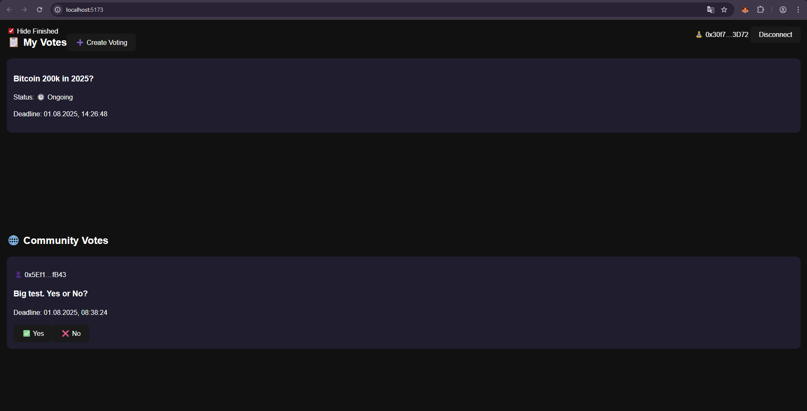

# FHE Private Voting Frontend

This project is the frontend for a decentralized voting platform built with [Zama FHEVM](https://docs.zama.ai/), using encrypted votes. Users can create polls and vote **privately**, without revealing their input until after the deadline.

---

## Features

- Zama FHE support via Relayer SDK
- Private voting with user-side decryption
- Create polls with configurable duration
- Automatically displays results after the deadline
- MetaMask / EVM wallet support

---

## Installation
```bash
git clone https://github.com/your-repo/zama-private-voting-frontend.git
cd zama-private-voting-frontend
npm install
```

---

## Local Development
npm run dev

The app will run at http://localhost:5173

## Visual demonstration



---

## Technologies Used
React + TypeScript

@zama-fhe/relayer-sdk

ethers.js v6

Tailwind CSS / custom CSS

MetaMask

---

## Configuration
The fheConfig.ts file contains the setup:

```bash
export const FACTORY_ADDRESS = "0x..."; // Factory contract address
export const FACTORY_ABI = [...];       // ABI for the factory
export const VOTING_ABI = [...];        // ABI for voting contracts
```

---

## Project Structure
```bash
.
├── src/
│   ├── App.tsx            # Main component
│   ├── fheConfig.ts       # Contract config and ABIs
│   ├── styles/            # Styling
│   └── ...
├── public/
├── index.html
└── vite.config.ts
```

---

## Security & Privacy
All votes are encrypted on the client using the FHE SDK

Only the vote owner can decrypt their choice (via EIP-712 signature)

Results can be made publicly decryptable after the deadline

---

## License
MIT © 2025
